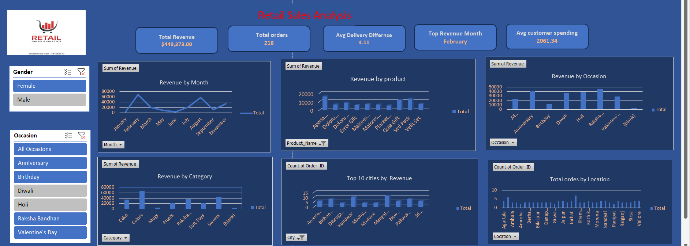

# Retail Sales Analysis

## 1. Project Overview
This project analyzes retail sales performance using three structured datasets: Customers, Orders, and Products. The objective is to extract actionable insights related to revenue performance, customer behavior, product contribution, and operational efficiency.

The analysis supports data-driven business decision-making using Excel-based analytics.

## 2. Dataset
** The project uses the following datasets:
- **Source:** Kaggle  
- **Customer Dataset**
- <a href="https://github.com/Krishbelwal/Retail-Sales-Analysis/blob/main/Customer_Dataset.csv">Dataset</a>
- **Order Dataset Dataset**
- <a href="https://github.com/Krishbelwal/Retail-Sales-Analysis/blob/main/Order_Dataset.csv">Dataset</a>
- **Product Dataset**
- <a href="https://github.com/Krishbelwal/Retail-Sales-Analysis/blob/main/Product_Dataset.csv">Dataset</a>

- ## 3. Tools & Technologies
- **Data Import:** Excel (Kaggle dataset)  
- **Data Cleaning:** Excel
- **Data Modelling - Power Pivot  
- **Data Analysis:** Excel(pivot table)
- **Data visualisation - Excel(pivot table)

- 
- ## 4. Project Workflow -
- **Business Problem Understanding
- **Data Understanding
- **Data Cleaning
- **Data Modellin
- **Data Analysis
- **Dashboard Creation

- ## 5. Key Insights
- **Strong Revenue with High AOV: The business generated high total revenue with a strong average order value, indicating premium or bundled purchasing behaviour.
- **Seasonal & Occasion-Driven Sales: Revenue significantly fluctuates across months, with peak performance during major festivals and special occasions.
- **Top Products Drive Majority Revenue: A small number of products contribute disproportionately to total revenue, indicating revenue concentration.
- **Geographic Revenue Concentration: A few cities account for the highest number of orders, while other regions show low penetration.
- **Customer Spending is Relatively High: Customers are willing to spend more per order, suggesting an opportunity for upselling and premium positioning.
- **Delivery Time Gap Exists: The average delivery time indicates potential operational inefficiencies that may impact customer satisfaction.

- ## 6. Recommendations
- **Implement Occasion-Based Marketing Strategy: Plan promotional campaigns before peak festivals to maximise revenue opportunities.
- **Expand & Promote Best-Selling Products: Focus on high-performing products while bundling or repositioning low-performing items.
- **Diversify Geographic Reach: Strengthen marketing in underperforming cities through localised campaigns and first-order discounts.
- **Improve Supply Chain & Delivery Efficiency: Optimise logistics to reduce delivery time and improve customer experience.
- **Introduce Customer Retention Programs: Launch loyalty rewards, personalised offers, and repeat-purchase incentives.
- **Enhance Data Tracking & KPIs: Add metrics such as profit margin, repeat purchase rate, and customer lifetime value for deeper strategic insights.
- ++++++++++++********************

- ## 8. Dashboard Preview
<a href="https://github.com/Krishbelwal/Retail-Sales-Analysis/blob/main/Project_Dashboard.png">View Dashboard</a>

# Open to collaboration and feedback — contributions and improvement ideas are welcome.
